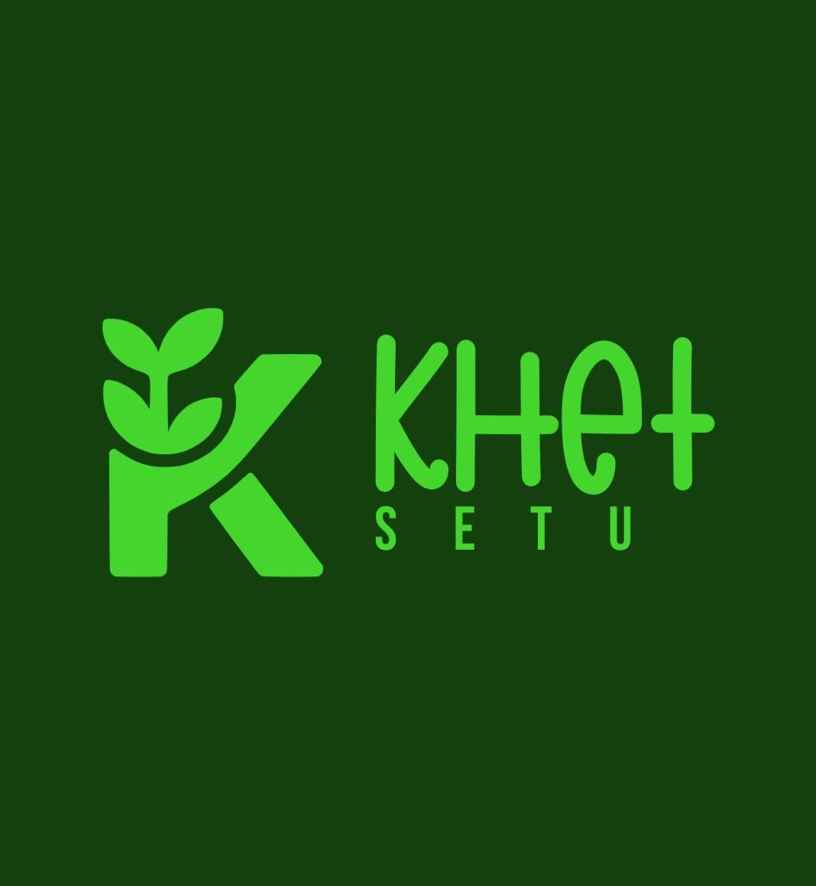

# 🌾 KhetSetu: Connecting Farmers, Knowledge & Sustainability

<div align="center">
  
  <p><strong>A gamified digital platform designed to educate, reward, and guide farmers toward sustainable agricultural practices.</strong></p>
  
  [](https://vercel.com)
  [](https://flask.palletsprojects.com/)
  [](https://huggingface.co/)
</div>

---

**KhetSetu** transforms traditional agriculture by combining gaming mechanics with powerful farm-management tools. Created by Team **Harvest Hackers** for **Smart India Hackathon 2025**.

👉 **Live Deployments:** 
* **Vercel (Serverless):** [https://khet-setu.vercel.app](https://khet-setu.vercel.app) *(Update with your URL!)*

---

## 🛑 The Problem

Despite numerous awareness campaigns, many farmers still rely on unsustainable practices—excessive chemical usage, over-irrigation, or mono-cropping—due to habit, lack of training, or limited engagement:

* 🌾 **Lack of Awareness:** Limited access to modern, easy-to-understand sustainable farming education.
* 🌦️ **Unpredictable Weather:** Climate uncertainty directly impacting sowing seasons and crop yields.
* 🚨 **Emergency Handling:** Inabilities to handle crop-damaging pests, floods, or sudden droughts.
* 💰 **Market Inequality:** Intermediaries making it hard to get fair prices or purchase quality tools.

---

## 💡 The Solution

KhetSetu drives behavioral change through gamification and state-of-the-art agricultural features:

### 🎮 1. Gamified Learning & Community
* **🌱 GreenQuiz:** Multi-crop interactive modules teaching eco-friendly farming practices.
* **🏆 Eco Points & Badges:** Earn XP and rewards for completing sustainable agricultural tasks.
* **📊 Leaderboard:** Encourages friendly competition and shared goals within the village communities.

### 🧠 2. Smart Agricultural Tools
* **🤖 AI Crop Health Detector:** Real-time disease classification using a Vision Transformer model (`wambugu71/crop_leaf_diseases_vit`).
* **🌦️ Weather Intel:** Current status and 3-day weather forecasts with action-oriented alerts.
* **🚨 Emergency Dashboard:** Quick action guides for three levels of agricultural dangers.

### 🛒 3. Integrated Marketplace
* **🌾 Crop Sales:** List produce directly for buyers to secure fair market rates.
* **🏷️ Eco Discounts:** Spend your earned "Eco Points" to get discounts on tools and fertilizers.

---

## 🛠️ Tech Stack

### Frontend & Styling
* 🎨 **UI:** HTML5, CSS3 (Custom Glassmorphic styles), Vanilla JavaScript.
* ✨ **Experience:** Dynamic CSS transitions, interactive form validation, and micro-animations.

### Backend & AI
* 🐍 **Backend:** Python + **Flask**
* 🔒 **Security:** Werkzeug (Secure password hashing and session management)
* 🧠 **AI/ML Inference:** 
  * *Local Mode:* PyTorch + Hugging Face Transformers.
  * *Serverless Mode:* Calls **Hugging Face Serverless Inference API** to keep deployment lightweight.
* 📡 **APIs:** WeatherAPI (Forecast, AQI, and weather alerts).

### Database & Deployment
* 🗄️ **Database:** SQLite (runs locally or via writeable `/tmp/farm_game.db` on serverless).
* 🚀 **Serverless Host:** **Vercel**
* 🌐 **Server Host:** **Render** + Gunicorn

---

## 🚀 Setup & Run Locally

### 1. Clone the repository
```bash
git clone https://github.com/Neetu-Sahu/Khet-Setu.git
cd Khet-Setu
```

### 2. Install Dependencies
```bash
pip install -r requirements.txt
```

*Note: If you want to run the AI model locally rather than via Hugging Face API, install the local ML libraries:*
```bash
pip install torch torchvision transformers
```

### 3. Initialize the Database
```bash
flask init-db
```

### 4. Run the Application
```bash
python app.py
```
Open **`http://127.0.0.1:5000`** in your browser.

---

## 🌎 Environment Variables

To configure external integrations (e.g., in Vercel or local `.env`):

| Variable | Description | Required / Optional |
| :--- | :--- | :--- |
| `WEATHERAPI_KEY` | Key from weatherapi.com for live forecasts | Optional (Uses mock data if missing) |
| `HF_API_TOKEN` | Read-only Hugging Face token to avoid inference limits | Optional (Highly recommended on Vercel) |
| `FLASK_SECRET_KEY` | Custom secret key for user sessions | Optional (Auto-generates if missing) |
